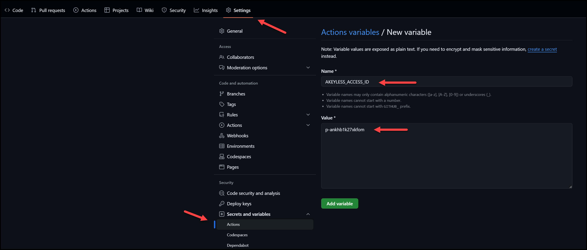
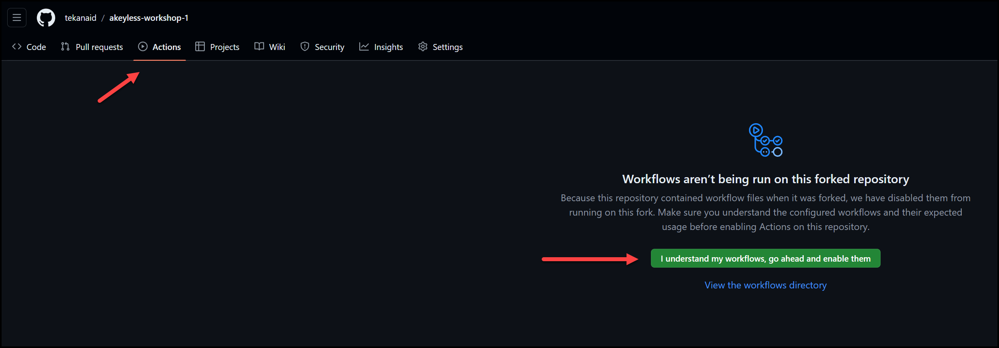

# Prepare the GitHub Actions Pipeline

In this lab we will get our pipeline ready and make sure we have the Akeyless plugin for GitHub Actions set up to retrieve the Port Credentials and the AWS Dynamic secret from the previous lab. This allows Terraform to use these AWS credentials to provision our EKS cluster in AWS.


<!-- @import "[TOC]" {cmd="toc" depthFrom=1 depthTo=6 orderedList=false} -->

<!-- code_chunk_output -->

- [Prepare the GitHub Actions Pipeline](#prepare-the-github-actions-pipeline)
  - [1. Run the script to prepare the GitHub Actions pipeline](#1-run-the-script-to-prepare-the-github-actions-pipeline)
  - [2. Add the Access ID as a GitHub Repository Variable](#2-add-the-access-id-as-a-github-repository-variable)
  - [3. Enable Workflows in your Repo](#3-enable-workflows-in-your-repo)

<!-- /code_chunk_output -->


## 1. Run the script to prepare the GitHub Actions pipeline 

```bash
Lab03/github_actions_prep.sh
```

This script will create an OAuth2.0/JWT Authentication Method for GitHub, an Access Role, and set the permissions for the AWS Dynamic Secret.

It will also output the Access ID that you will use in the next step to store it as a GitHub Rpository Variable. Look for an output like this:

```
Access ID to be used as a GitHub Repository Variable: p-f1yktspd8eddom
```

## 2. Add the Access ID as a GitHub Repository Variable

You can store the Access ID as a GitHub variable inside the repository to use in your workflow.

In the following examples, instead of explicitly specifying the Access ID of the Authentication Method inside the workflow, we store it as a variable in the repository called `AKEYLESS_ACCESS_ID`.

On GitHub, navigate to the main page of the repository, and select Settings > Secrets and variables > Actions > Variables tab > New repository variable.
Enter the name for the variable as `AKEYLESS_ACCESS_ID` and set the value to your Auth Method Access ID.

Select Add Variable.



## 3. Enable Workflows in your Repo

Since you've forked this repo, you need to enable the GitHub Actions workflows. Go to the Actions tab and click the button `I understand my workflows, go ahead and enable them`.



> You've reached the end of the lab.