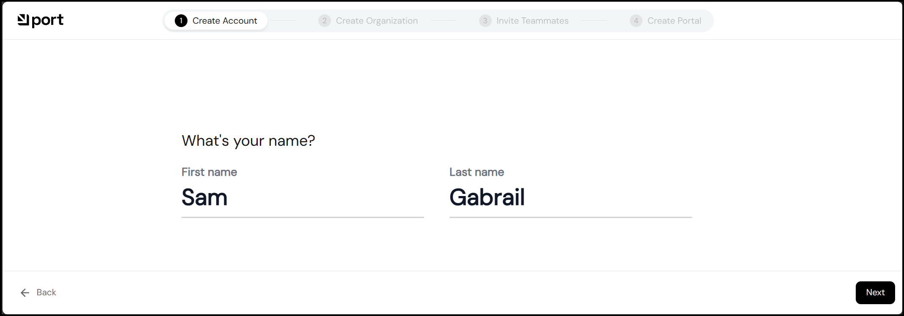
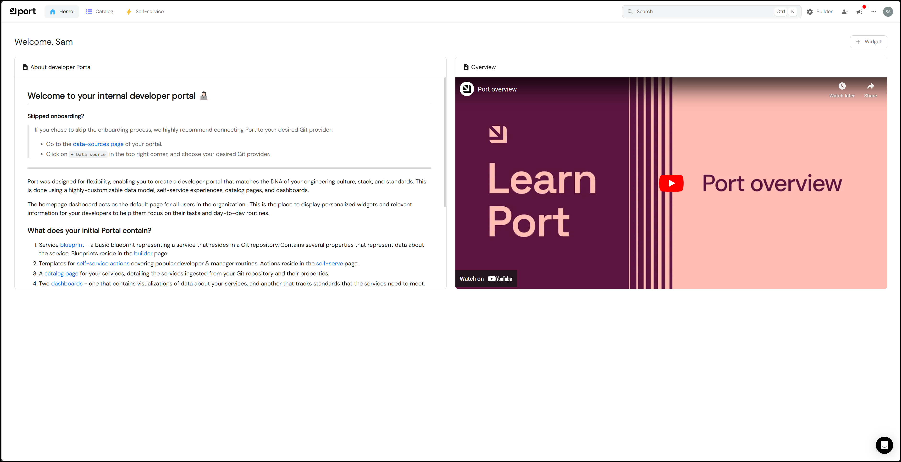
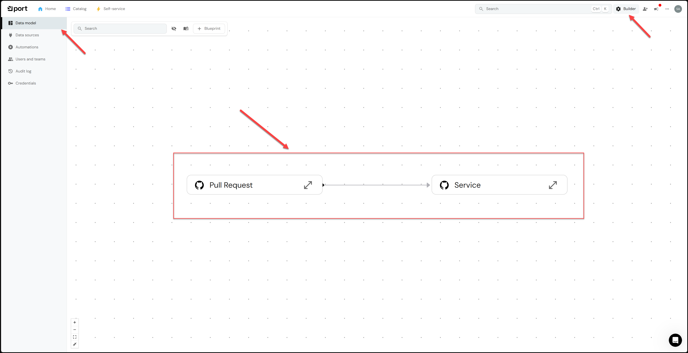
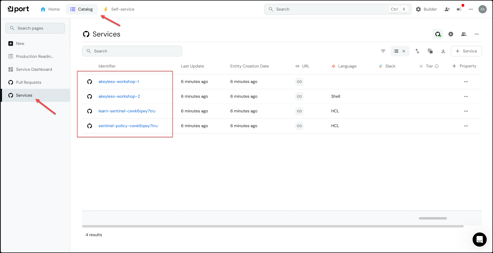
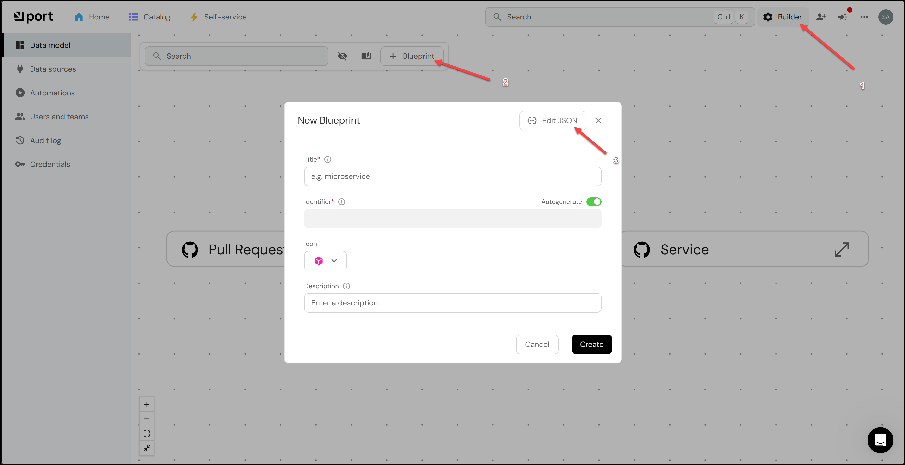
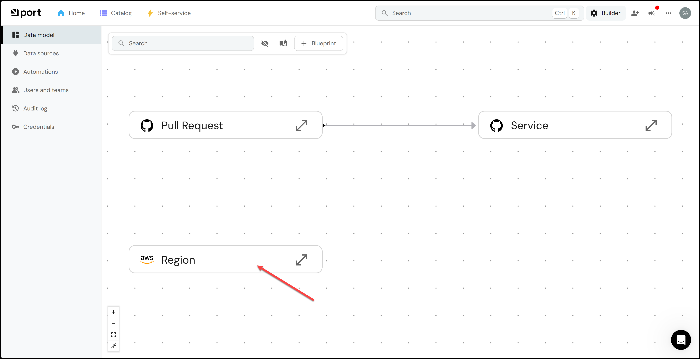
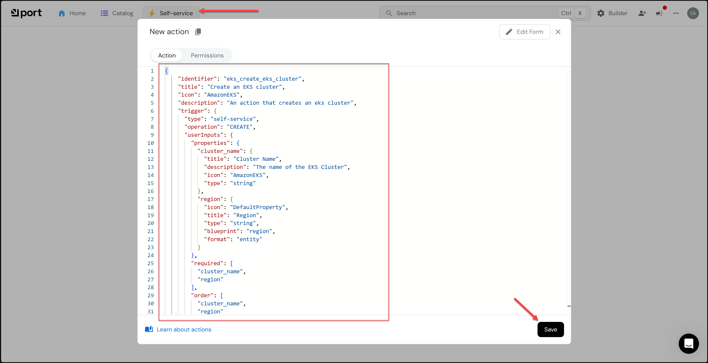
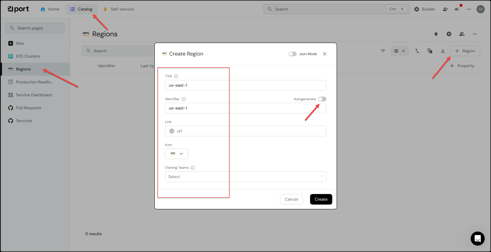

# Setup Port

In this lab we will Create an EKS cluster from Port.

<!-- @import "[TOC]" {cmd="toc" depthFrom=1 depthTo=6 orderedList=false} -->

<!-- code_chunk_output -->

- [Setup Port](#setup-port)
  - [1. Sign up for Port](#1-sign-up-for-port)
  - [2. Install Port's GitHub app](#2-install-ports-github-app)
  - [3. Create the Region Blueprint](#3-create-the-region-blueprint)
  - [4. Create the EKS Cluster Blueprint](#4-create-the-eks-cluster-blueprint)
  - [5. Create a Port Action against the EKS Cluster Blueprint:](#5-create-a-port-action-against-the-eks-cluster-blueprint)
  - [6. Add AWS Regions](#6-add-aws-regions)
  - [7. Create an EKS Cluster](#7-create-an-eks-cluster)
  - [7. Check the AWS Console \[Optional\]](#7-check-the-aws-console-optional)
  - [9. Access the Cluster](#9-access-the-cluster)

<!-- /code_chunk_output -->

I will need to start with a brand new Port account.
Will need to grab info from the following guide and use it for this lab:
https://docs.getport.io/guides/all/create-eks-cluster-and-deploy-app/


## 1. Sign up for Port

Go to https://www.getport.io/ and sign up for a free account.

Go through the onboarding process of creating an account, adding your first and last name, an organization, and then skip inviting teammates and adding a Version Control System.

Here is the screenshot of the onboarding process:



and here is the screenshot of your home page once you're onboarded:



## 2. Install Port's GitHub app

Click this link to install Port's GitHub app: https://github.com/apps/getport-io/installations/new

Once you've successfully installed the app, you will see the data model get updated in Port. Go to Builder in the top right and click on "Data Model" to see the new data model.



You will also see new Data Sources appear as shown below:


Finally, if you go to the Catalog and Services, you will see your GitHub repos there as shown below:



## 3. Create the Region Blueprint

Go to Builder in the top right and click on "Blueprints" then click on "Edit JSON" as shown below:



Next copy the content of the file `port/blueprints/region.json` in this repo and paste it into the JSON editor.


Finally, click on "Save" to save the blueprint. You will see the blueprint appear in the Data Model as shown below:



## 4. Create the EKS Cluster Blueprint

Follow the same steps as above to create the EKS Cluster Blueprint. The content of the file `port/blueprints/eks-cluster.json` in this repo should be pasted into the JSON editor. Your data model should look like this:


## 5. Create a Port Action against the EKS Cluster Blueprint:

Go to the self-service page.
Click on the + Action button.
Click on the {...} Edit JSON button in the top right corner.
Copy and paste the JSON configuration in the `port/self-service-actions/create_eks_cluster.json` file into the editor.
Make sure to **REPLACE** the `your_org_name` and `your_repo_name` with your actual organization and repo name.
Click Save



You should now see your new self-service action appear in the list of actions as shown below:


## 6. Add AWS Regions

Go to the `Catalog` page and click on `Regions` and then click on the `+ Region` button.

Fill out the form with the following values making sure to uncheck the `Autogenerate` radio button:
- Title: `us-east-1`
- Identifier: `us-east-1`



You could optionally add more regions if you wish.

## 7. Create an EKS Cluster

Go to the self-service page and click on the `Create` button under the `Create an EKS Cluster` action.


## 7. Check the AWS Console [Optional]

If you wish, you could log into the AWS console and see your EKS cluster there. Below is a snapshot of what you would see.


## 9. Access the Cluster

To get the kubeconfig for the cluster, run the command below replacing <your-eks-cluster-name> with your eks cluster name which will show up in the output of terraform or you can see in the AWS console.

```bash
aws eks update-kubeconfig --region us-east-1 --name <your-eks-cluster-name>
```

> Note: If after you run the pipeline and find that you get an error accessing the cluster, it could be that you need to refresh the AWS credentials you're using, that is if you are using the ones provided by TeKanAid Academy. You can refresh them by running the command: `/.start.sh` again.

You can now use `kubectl` to access the cluster.

Below are some suggested commands for you to run.

```bash
@tekanaid ➜ /workspaces/akeyless-workshop-1/terraform (main) $ kubens
default
kube-node-lease
kube-public
kube-system
@tekanaid ➜ /workspaces/akeyless-workshop-1/terraform (main) $ kubens kube-system
Context "arn:aws:eks:us-east-1:047709130171:cluster/workshop-1-AYEsefOJ" modified.
Active namespace is "kube-system".
@tekanaid ➜ /workspaces/akeyless-workshop-1/terraform (main) $ kga
NAME                                      READY   STATUS    RESTARTS   AGE
pod/aws-node-p9sc2                        2/2     Running   0          21m
pod/aws-node-pd6f6                        2/2     Running   0          21m
pod/aws-node-tltng                        2/2     Running   0          21m
pod/coredns-54d6f577c6-s6xfm              1/1     Running   0          44m
pod/coredns-54d6f577c6-x29rp              1/1     Running   0          44m
pod/ebs-csi-controller-7bb6f55486-25kx2   6/6     Running   0          22m
pod/ebs-csi-controller-7bb6f55486-g85fd   6/6     Running   0          22m
pod/ebs-csi-node-942jx                    3/3     Running   0          21m
pod/ebs-csi-node-vlvf6                    3/3     Running   0          21m
pod/ebs-csi-node-wsqlk                    3/3     Running   0          21m
pod/kube-proxy-brcvz                      1/1     Running   0          21m
pod/kube-proxy-qtdn5                      1/1     Running   0          21m
pod/kube-proxy-twhjb                      1/1     Running   0          21m

NAME               TYPE        CLUSTER-IP    EXTERNAL-IP   PORT(S)                  AGE
service/kube-dns   ClusterIP   172.20.0.10   <none>        53/UDP,53/TCP,9153/TCP   44m

NAME                                  DESIRED   CURRENT   READY   UP-TO-DATE   AVAILABLE   NODE SELECTOR              AGE
daemonset.apps/aws-node               3         3         3       3            3           <none>                     44m
daemonset.apps/ebs-csi-node           3         3         3       3            3           kubernetes.io/os=linux     22m
daemonset.apps/ebs-csi-node-windows   0         0         0       0            0           kubernetes.io/os=windows   22m
daemonset.apps/kube-proxy             3         3         3       3            3           <none>                     44m

NAME                                 READY   UP-TO-DATE   AVAILABLE   AGE
deployment.apps/coredns              2/2     2            2           44m
deployment.apps/ebs-csi-controller   2/2     2            2           22m

NAME                                            DESIRED   CURRENT   READY   AGE
replicaset.apps/coredns-54d6f577c6              2         2         2       44m
replicaset.apps/ebs-csi-controller-7bb6f55486   2         2         2       22m
```

> You've reached the end of the lab.