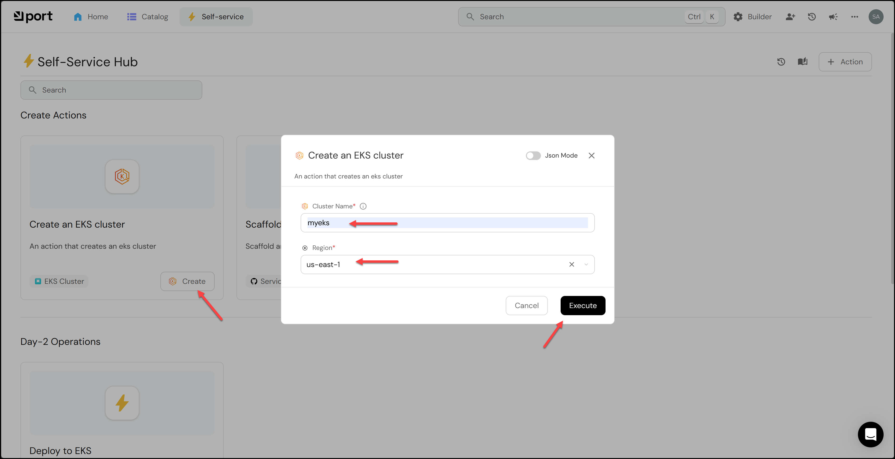
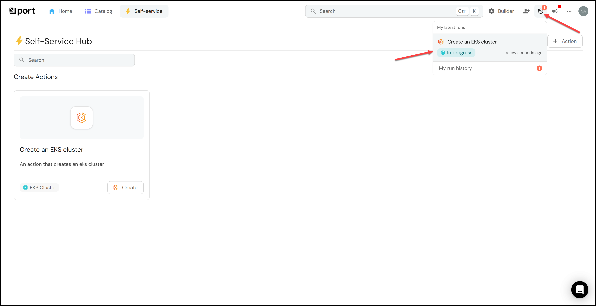

# Build the EKS Cluster from Port

In this lab we will build the EKS cluster from Port.

<!-- @import "[TOC]" {cmd="toc" depthFrom=1 depthTo=6 orderedList=false} -->

<!-- code_chunk_output -->

- [Build the EKS Cluster from Port](#build-the-eks-cluster-from-port)
  - [1. Commit and Push the Changes](#1-commit-and-push-the-changes)
  - [2. Create an EKS Cluster](#2-create-an-eks-cluster)
  - [2. Check the GitHub Actions Workflow](#2-check-the-github-actions-workflow)
  - [7. Check the AWS Console \[Optional\]](#7-check-the-aws-console-optional)
  - [9. Access the Cluster](#9-access-the-cluster)

<!-- /code_chunk_output -->

## 1. Commit and Push the Changes

Before we can create an EKS cluster, we need to commit and push the changes to the repository. Mainly, we need to update the Gateway URL in the GitHub Actions Workflow. The Gateway URL is stored in the file `akeyless_gateway_url.txt` in the root of this repository. The workflow will read this file and use the URL for multiple purposes.

In a terminal, run the following commands:

```bash
git add .
git commit -m "Update the Gateway URL in the GitHub Actions Workflow"
git push
```

## 2. Create an EKS Cluster

Go to the self-service page and click on the `Create` button under the `Create an EKS Cluster` action. Give it a name and select the us-east-1 region then click `Execute`.



You can then see the run progress by clicking the `My latest runs` button at the top right.



## 2. Check the GitHub Actions Workflow

After a few seconds, a GitHub icon will appear and if you click it, it will take you to the GitHub Actions workflow.


## 7. Check the AWS Console [Optional]

If you wish, you could log into the AWS console and see your EKS cluster there. Below is a snapshot of what you would see.


## 9. Access the Cluster

To get the kubeconfig for the cluster, run the command below replacing <your-eks-cluster-name> with your eks cluster name which will show up in the output of terraform or you can see in the AWS console.

```bash
aws eks update-kubeconfig --region us-east-1 --name <your-eks-cluster-name>
```

> Note: If after you run the pipeline and find that you get an error accessing the cluster, it could be that you need to refresh the AWS credentials you're using, that is if you are using the ones provided by TeKanAid Academy. You can refresh them by running the command: `/.start.sh` again.

You can now use `kubectl` to access the cluster.

Below are some suggested commands for you to run.

```bash
@tekanaid ➜ /workspaces/akeyless-workshop-1/terraform (main) $ kubens
default
kube-node-lease
kube-public
kube-system
@tekanaid ➜ /workspaces/akeyless-workshop-1/terraform (main) $ kubens kube-system
Context "arn:aws:eks:us-east-1:047709130171:cluster/workshop-1-AYEsefOJ" modified.
Active namespace is "kube-system".
@tekanaid ➜ /workspaces/akeyless-workshop-1/terraform (main) $ kga
NAME                                      READY   STATUS    RESTARTS   AGE
pod/aws-node-p9sc2                        2/2     Running   0          21m
pod/aws-node-pd6f6                        2/2     Running   0          21m
pod/aws-node-tltng                        2/2     Running   0          21m
pod/coredns-54d6f577c6-s6xfm              1/1     Running   0          44m
pod/coredns-54d6f577c6-x29rp              1/1     Running   0          44m
pod/ebs-csi-controller-7bb6f55486-25kx2   6/6     Running   0          22m
pod/ebs-csi-controller-7bb6f55486-g85fd   6/6     Running   0          22m
pod/ebs-csi-node-942jx                    3/3     Running   0          21m
pod/ebs-csi-node-vlvf6                    3/3     Running   0          21m
pod/ebs-csi-node-wsqlk                    3/3     Running   0          21m
pod/kube-proxy-brcvz                      1/1     Running   0          21m
pod/kube-proxy-qtdn5                      1/1     Running   0          21m
pod/kube-proxy-twhjb                      1/1     Running   0          21m

NAME               TYPE        CLUSTER-IP    EXTERNAL-IP   PORT(S)                  AGE
service/kube-dns   ClusterIP   172.20.0.10   <none>        53/UDP,53/TCP,9153/TCP   44m

NAME                                  DESIRED   CURRENT   READY   UP-TO-DATE   AVAILABLE   NODE SELECTOR              AGE
daemonset.apps/aws-node               3         3         3       3            3           <none>                     44m
daemonset.apps/ebs-csi-node           3         3         3       3            3           kubernetes.io/os=linux     22m
daemonset.apps/ebs-csi-node-windows   0         0         0       0            0           kubernetes.io/os=windows   22m
daemonset.apps/kube-proxy             3         3         3       3            3           <none>                     44m

NAME                                 READY   UP-TO-DATE   AVAILABLE   AGE
deployment.apps/coredns              2/2     2            2           44m
deployment.apps/ebs-csi-controller   2/2     2            2           22m

NAME                                            DESIRED   CURRENT   READY   AGE
replicaset.apps/coredns-54d6f577c6              2         2         2       44m
replicaset.apps/ebs-csi-controller-7bb6f55486   2         2         2       22m
```

> You've reached the end of the lab.